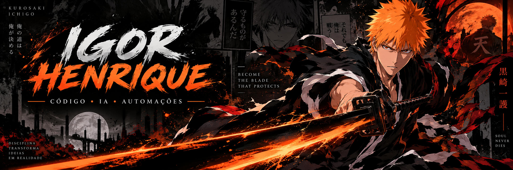
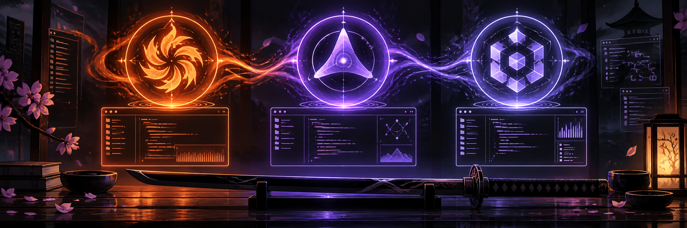
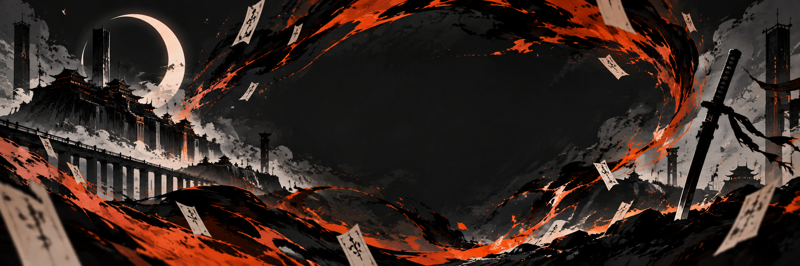
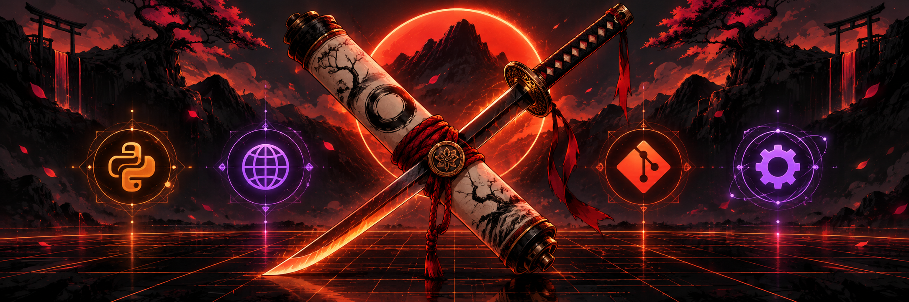
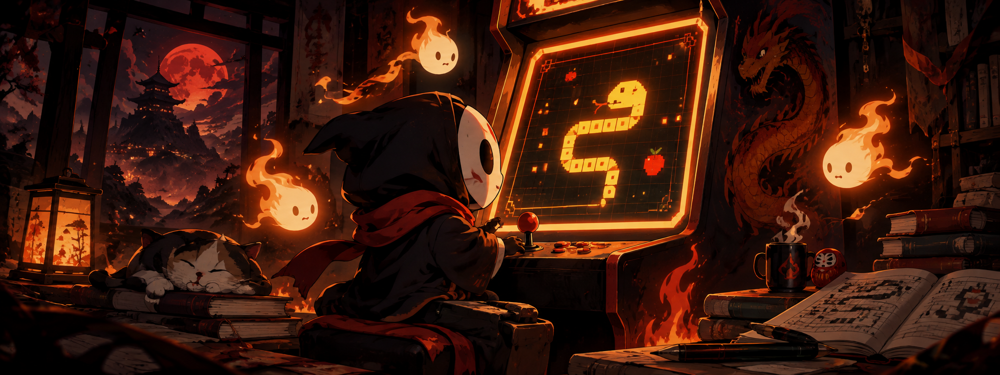

<div align="center">


<br>


<br>


</div>

---

## 🩸 IGOR HENRIQUE // HOLLOW MODE

<div align="center">

</div>

Sou **contador**, estudante de tecnologia e criador em transição para o desenvolvimento de software.

Transformo ideias em protótipos funcionais usando **IA como parceira de aprendizagem**, documentação e experimentação — sempre revisando o código para entender o porquê de cada decisão.

```text
🎯 foco    → programação + automações + IA
🧠 método  → construir → testar → entender → melhorar
👾 status  → learning.exe em execução
⚡ missão   → transformar curiosidade em produtos úteis
```

> **“Eu não luto porque acho que posso vencer. Eu luto porque tenho que vencer.”**

Minha regra de desenvolvimento: transformar pressão em evolução, bugs em aprendizado e ideias em algo que possa ser usado por alguém.

---

## 🎴 ANIME DNA

Não é só decoração: uso a linguagem dos animes para contar como trabalho e aprendo.

<div align="center">
  
  
</div>

| Elemento | Na minha jornada |
| :--- | :--- |
| ⚔️ **Zanpakutō** | Ferramentas são extensões da criatividade; o resultado é o que importa. |
| 🔥 **Reiatsu** | Energia para sair da ideia e chegar a um projeto funcionando. |
| ☠️ **Hollow** | Bugs, erros e travas fazem parte da transformação. |
| 📖 **Manga panel** | Cada commit registra uma nova página da evolução. |

---

## ⚔️ MEU ARSENAL DE IA

Uso diferentes agentes e interfaces de código para acelerar o ciclo completo: **idear → construir → testar → revisar → publicar**.

<div align="center">
  
</div>

<table align="center">
  <tr>
    <td align="center" width="33%"><b>Claude Code</b><br><sub>Explorar ideias, refatorar e aprender com o terminal.</sub></td>
    <td align="center" width="33%"><b>Antigravity</b><br><sub>Experimentar interfaces e transformar conceitos em protótipos.</sub></td>
    <td align="center" width="33%"><b>Codex CLI</b><br><sub>Implementar, depurar e iterar com contexto do projeto.</sub></td>
  </tr>
</table>

> A ferramenta muda; o princípio permanece: escrever código compreensível, testar hipóteses e evoluir em público.

---



## 🧠 STACK EM TREINAMENTO

<div align="center">



<br><br>


<br><br>


</div>

---


## 🎮 PROJETO EM DESTAQUE

### Python Game Education

Projeto web para **estudar fundamentos de Python de forma interativa**, com exercícios, múltipla escolha, progresso e revisão de conteúdo.

<div align="center">

<a href="https://github.com/igoorhenrique15-dotcom/python-game-education">
  
</a>

<br><br>


<br><br>

<a href="https://github.com/igoorhenrique15-dotcom/python-game-education"></a>
<a href="https://igoorhenrique15-dotcom.github.io/python-game-education/"></a>

</div>

---

## 🔥 O QUE ESTOU CONSTRUINDO

- **Experiências educacionais:** interfaces que tornam o aprendizado de programação mais prático e visual.
- **Automações inteligentes:** pequenos fluxos para reduzir tarefas repetitivas e organizar processos.
- **Projetos com agentes:** explorando como Claude Code, Antigravity e Codex CLI podem colaborar no desenvolvimento.
- **Fundamentos sólidos:** Python, web, Git, acessibilidade, documentação e boas práticas de produto.

## 🗺️ ARCO DE EVOLUÇÃO

```text
agora       → consolidar Python, JavaScript e arquitetura de projetos
em seguida  → criar automações úteis para rotinas reais
depois      → publicar projetos completos, documentados e acessíveis
sempre      → aprender, compartilhar e melhorar
```

```text
[fundamentos] ──▶ [projetos reais] ──▶ [automações] ──▶ [produtos completos]
      │                   │                  │                    │
    Python              web + Git          agentes             publicar + iterar
```

---

## 📡 CONEXÃO

Se você gosta de tecnologia, anime, automações ou projetos que nascem do zero, seja bem-vindo ao meu universo.

<div align="center">
  <a href="https://github.com/igoorhenrique15-dotcom"></a>
  <a href="https://github.com/igoorhenrique15-dotcom/python-game-education"></a>
</div>

---

## 📊 MEU GITHUB

<div align="center">


</div>

---

<div align="center">


</div>
