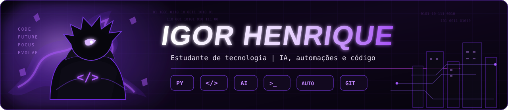
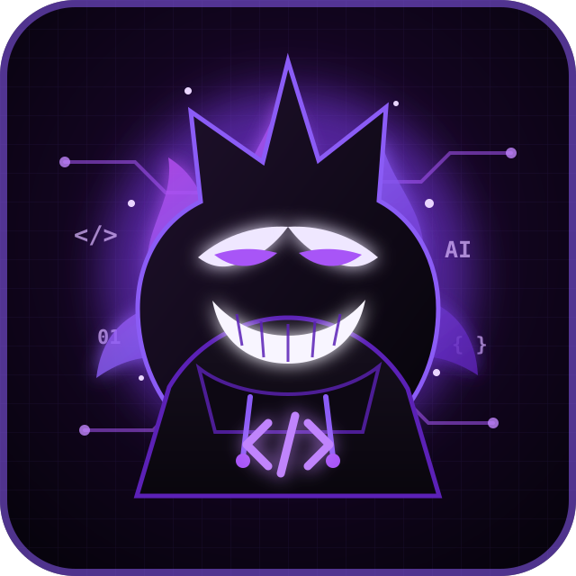

<div align="center">



<br>


<br>


</div>

---

## 👾 Sobre mim



Sou **contador** e **estudante de tecnologia**, começando minha jornada em programação.

Uso **Inteligência Artificial como apoio para aprender, testar ideias e construir projetos**. Meu foco é evoluir na prática, entendendo cada vez mais o que estou criando.

```text
🎯 foco atual  → programação + automações + IA
🧠 método      → construir → testar → errar → entender → melhorar
⚡ objetivo    → transformar ideias em projetos funcionais
👾 status      → learning.exe em execução
```

<br clear="right"/>

---

## 🟣 Estudando agora

<div align="center">


<br><br>


</div>

> Aprendendo o suficiente para entender melhor o código, usar IA com mais critério e criar projetos cada vez melhores.

---

## 🎮 Projeto em destaque

### Python Game Education

Uma plataforma web criada para **estudar fundamentos de Python de forma interativa**, com exercícios rápidos, múltipla escolha, progresso das lições e revisão de conteúdo.

<div align="center">

<a href="https://github.com/igoorhenrique15-dotcom/python-game-education">
  
</a>

<br><br>


<br><br>

<a href="https://github.com/igoorhenrique15-dotcom/python-game-education"></a>
<a href="https://igoorhenrique15-dotcom.github.io/python-game-education/"></a>

</div>

---

## 📊 Meu GitHub

<div align="center">


</div>

---

<div align="center">


### `BUILD > BREAK > LEARN > REPEAT`

<sub>Começando agora. Construindo sempre.</sub>

<br><br>


</div>
