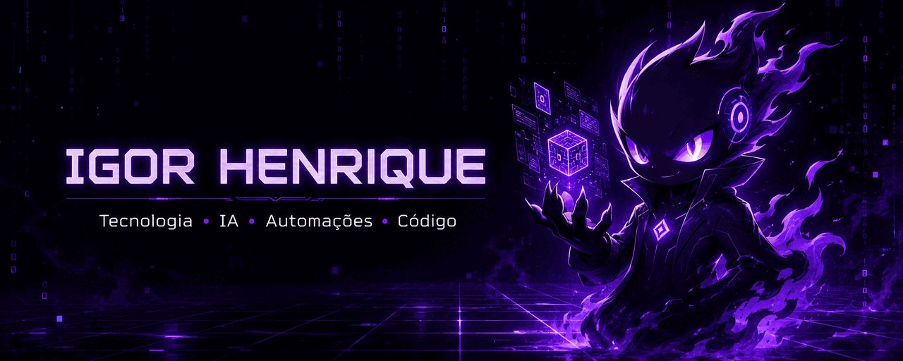

<div align="center">



<br>


<br>


</div>

---

## 👾 Sobre mim

<div align="center">
  
</div>

Sou **contador** e **estudante de tecnologia**, começando minha jornada em programação.

Uso **IA como apoio para aprender e construir projetos**, sempre tentando entender melhor o código e evoluir na prática.

```text
🎯 foco    → programação + automações + IA
🧠 método  → construir → testar → entender → melhorar
👾 status  → learning.exe em execução
```

---

## 🟣 Estudando agora

<div align="center">


<br><br>


</div>

---

## 🎮 Projeto em destaque

### Python Game Education

Projeto web para **estudar fundamentos de Python de forma interativa**, com exercícios, múltipla escolha, progresso e revisão de conteúdo.

<div align="center">

<a href="https://github.com/igoorhenrique15-dotcom/python-game-education">
  
</a>

<br><br>


<br><br>

<a href="https://github.com/igoorhenrique15-dotcom/python-game-education"></a>
<a href="https://igoorhenrique15-dotcom.github.io/python-game-education/"></a>

</div>

---

## 📊 Meu GitHub

<div align="center">


</div>

---

<div align="center">


</div>
